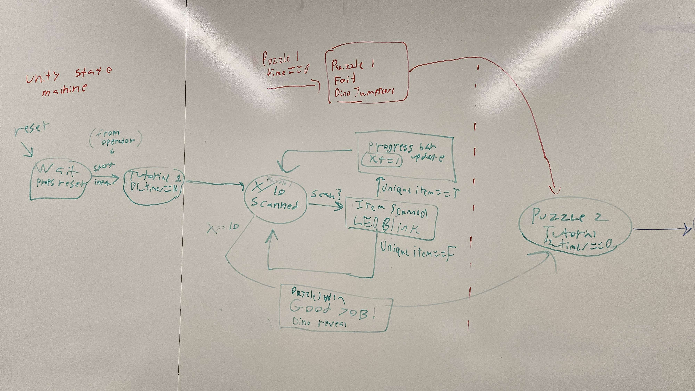
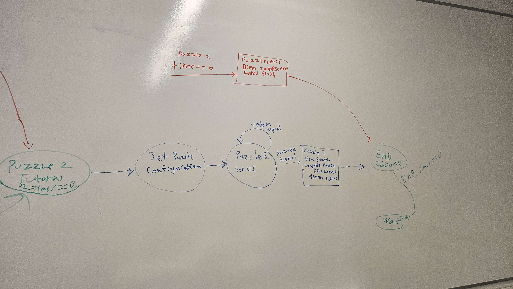
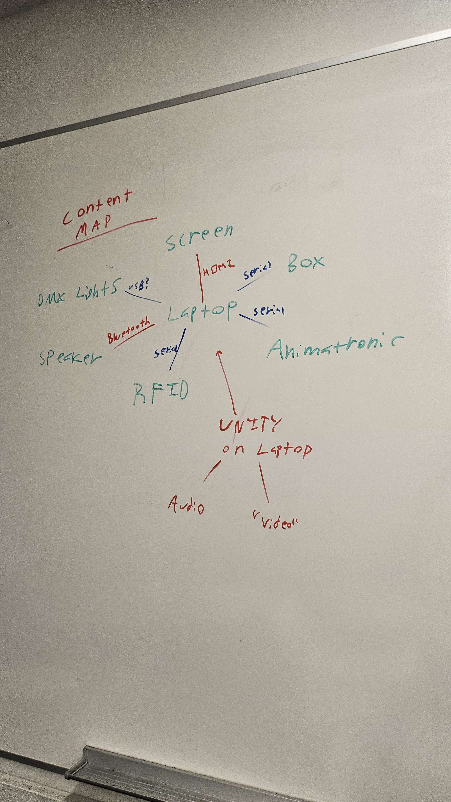
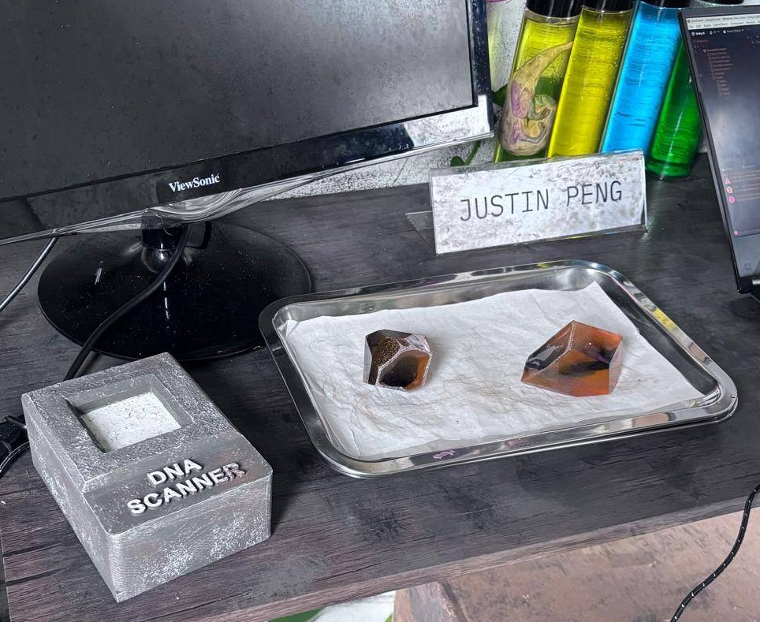
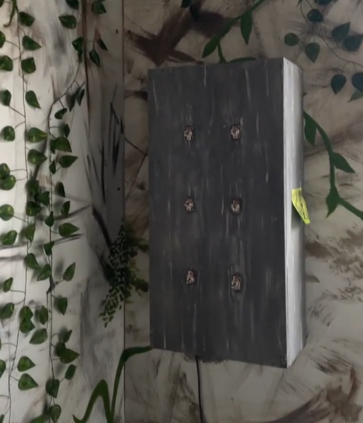
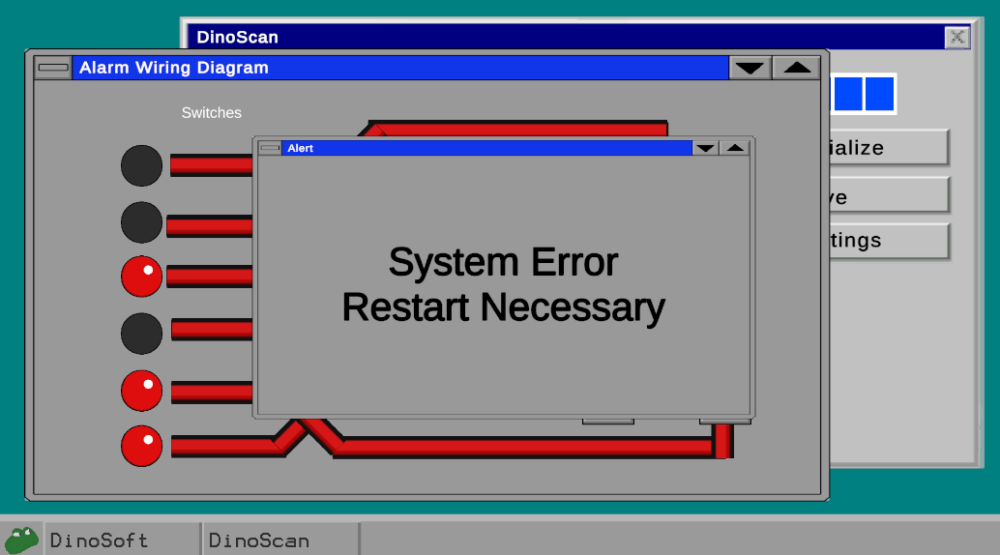
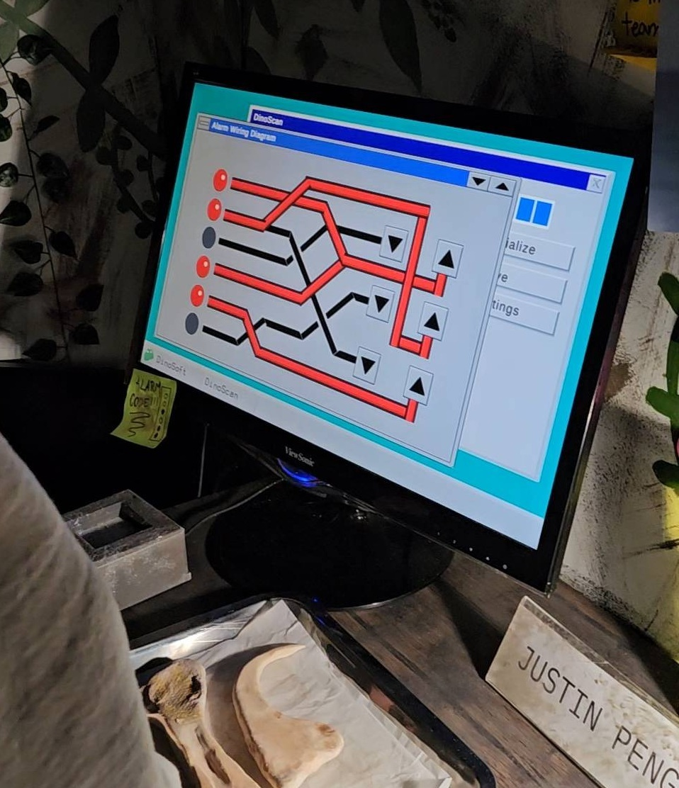

# Jurassic Park Booth Game
An immersive escape room-style attraction created for CMU's 2025 Spring Carnival.

## Overview
This project powered the interactive experience behind our Jurassic Park booth, synchronizing Arduino-based puzzle inputs with an animatronic dinosaur and audiovisual effects. It was developed by members of CMU's Theme Park Engineering Group and Sustainable Earth and won first place overall out of 21 student organizations.

## Features
- Finite State Machine to control game state based on puzzle inputs
- Unity-controlled UI and sound effects
- Serial communication with multiple Arduino controllers
- Two puzzles (RFID "DNA Scanner" and Circuit Breaker)
- User-triggered animatronic effects

## System Design
The first puzzle involves guests scanning multiple RFID-embedded props with a custom-built "DNA Scanner". After scanning 3 unique items (or running out of time), the dinosaur animatronic growls, and the next puzzle begins. The second puzzle involves guests interacting with a custom-built circuit breaker box, using the dynamic wiring diagram on the screen to match an alarm code found within the attraction. Upon successful completion of this puzzle within the time limit, the alarm sounds, saving the guests from the dinosaur. If guests run out of time, the dinosaur roars, and the guests lose. Between parties, the screen displays a fake error screen to maintain guest immersion.

For more information on the various Arduinos involved in the project, check out [the dinoArduinos repo](github.com/p0nk0/DinoArduinos)

The core game logic was driven by a state machine with 14 states. Each state represents commands to visuals, sound, and hardware. Each transition represents a signal received by the Unity controller.

Here's a hardware map of the project, showing how various components interface with the Unity project.

## Setup
- Use Unity 6000.0.40f1
- Make sure each Arduino's COM port and baud rate match its respective SerialControllers object
- To add/remove scannable items for puzzle 1, edit validProps in GameStateManager.cs
- Press play!
- If Debug Mode is set in the Game State Manager, there are various keyboard overrides to skip states
  - Any key starts the game
  - Space skips wins the first puzzle

## My contributions
- Designed and created the game state logic
- Set up all Serial Communication using the Ardity library
- Created Mock UI
- Integrated project with Animatronic, Props, and Speaker (on-site)
- Playtested game (on-site)

## Media

## Credits
- Kenechukwu Echezona: UI logic
- Angie Mendenhall and Sophie Howard: UI Assets
- Matthew Saenz: Lots of help along the way
- Kesha Bagadia: on-site testing
- The 2025 Theme Park Engineering Group and Sustainable Earth Booth Team
  - Samuel Chen - Head Booth Chair, Electrical Chair
  - Taylor Kynard, Ella Vander Velde - Paint Chairs
  - Jose Echeverria, Nathan Cottrell, Seth Altman - Structural and Construction Chairs
  - Matthew Saenz - Animatronic Lead
  - Louise Cutter - Props Lead
- Ardity
